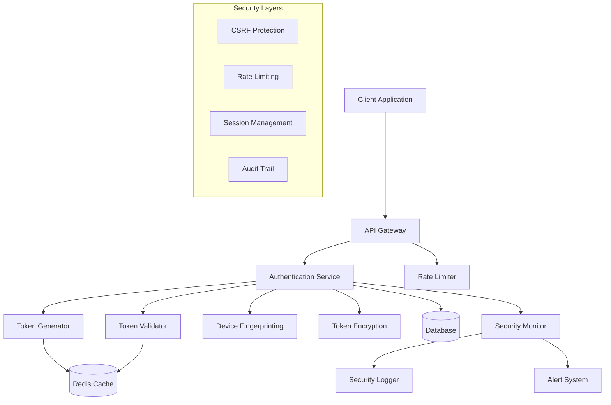
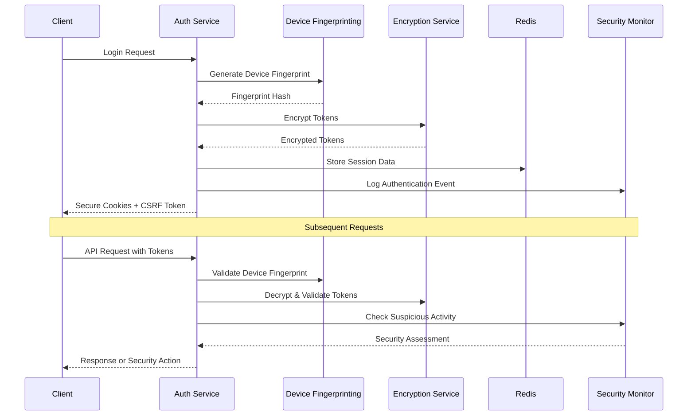

# Design Document - Secure Token Management System

## Overview

The Secure Token Management System is designed to provide enterprise-grade security for authentication and session management. It implements multiple layers of security including token rotation, device fingerprinting, encryption, and behavioral analysis to protect against various attack vectors including token theft, session hijacking, XSS, CSRF, and brute force attacks.

## Architecture

### High-Level Architecture



### Security Flow



## Components and Interfaces

### 1. Token Management Service

**Purpose:** Core service for token generation, validation, and lifecycle management

**Key Classes:**
- `TokenManager`: Main orchestrator for token operations
- `AccessTokenGenerator`: Generates short-lived access tokens
- `RefreshTokenGenerator`: Generates long-lived refresh tokens
- `TokenValidator`: Validates and verifies token integrity

**Interfaces:**
```typescript
interface ITokenManager {
  generateTokenPair(userId: string, deviceFingerprint: string): Promise<TokenPair>;
  refreshTokens(refreshToken: string, deviceFingerprint: string): Promise<TokenPair>;
  validateAccessToken(token: string, context: SecurityContext): Promise<TokenValidationResult>;
  invalidateAllUserTokens(userId: string): Promise<void>;
}

interface TokenPair {
  accessToken: string;
  refreshToken: string;
  accessTokenExpiry: Date;
  refreshTokenExpiry: Date;
}

interface SecurityContext {
  ipAddress: string;
  userAgent: string;
  deviceFingerprint: string;
  csrfToken?: string;
}
```

### 2. Device Fingerprinting Service

**Purpose:** Creates unique device signatures to bind tokens to specific devices

**Key Classes:**
- `DeviceFingerprintGenerator`: Creates device fingerprints
- `FingerprintValidator`: Validates device consistency
- `FingerprintStorage`: Manages fingerprint persistence

**Interfaces:**
```typescript
interface IDeviceFingerprintService {
  generateFingerprint(clientInfo: ClientInfo): string;
  validateFingerprint(storedFingerprint: string, currentFingerprint: string): boolean;
  updateFingerprint(userId: string, newFingerprint: string): Promise<void>;
}

interface ClientInfo {
  userAgent: string;
  acceptLanguage: string;
  screenResolution: string;
  timezone: string;
  platform: string;
}
```

### 3. Encryption Service

**Purpose:** Handles encryption and decryption of tokens and sensitive data

**Key Classes:**
- `TokenEncryption`: Encrypts/decrypts tokens
- `KeyManager`: Manages encryption keys and rotation
- `CryptoUtils`: Utility functions for cryptographic operations

**Interfaces:**
```typescript
interface IEncryptionService {
  encryptToken(token: string, keyId?: string): Promise<string>;
  decryptToken(encryptedToken: string): Promise<string>;
  rotateKeys(): Promise<void>;
  generateSecureRandom(length: number): string;
}
```

### 4. Security Monitor Service

**Purpose:** Monitors authentication events and detects suspicious activities

**Key Classes:**
- `SecurityMonitor`: Main monitoring orchestrator
- `AnomalyDetector`: Detects unusual patterns
- `ThreatAnalyzer`: Analyzes potential security threats
- `SecurityLogger`: Logs security events

**Interfaces:**
```typescript
interface ISecurityMonitor {
  logAuthenticationEvent(event: AuthEvent): Promise<void>;
  detectSuspiciousActivity(userId: string, context: SecurityContext): Promise<ThreatLevel>;
  handleSecurityIncident(incident: SecurityIncident): Promise<void>;
  generateSecurityReport(timeRange: TimeRange): Promise<SecurityReport>;
}

enum ThreatLevel {
  LOW = 'low',
  MEDIUM = 'medium',
  HIGH = 'high',
  CRITICAL = 'critical'
}
```

### 5. Rate Limiting Service

**Purpose:** Implements rate limiting and brute force protection

**Key Classes:**
- `RateLimiter`: Core rate limiting logic
- `BruteForceProtector`: Specific protection against brute force attacks
- `IPBlocklist`: Manages blocked IP addresses

**Interfaces:**
```typescript
interface IRateLimitService {
  checkRateLimit(key: string, limit: number, window: number): Promise<RateLimitResult>;
  incrementCounter(key: string, window: number): Promise<void>;
  blockIP(ipAddress: string, duration: number): Promise<void>;
  isBlocked(ipAddress: string): Promise<boolean>;
}

interface RateLimitResult {
  allowed: boolean;
  remaining: number;
  resetTime: Date;
  retryAfter?: number;
}
```

### 6. Session Management Service

**Purpose:** Manages user sessions and concurrent session limits

**Key Classes:**
- `SessionManager`: Core session management
- `SessionStore`: Session persistence layer
- `SessionCleanup`: Automated cleanup of expired sessions

**Interfaces:**
```typescript
interface ISessionManager {
  createSession(userId: string, context: SecurityContext): Promise<Session>;
  getSession(sessionId: string): Promise<Session | null>;
  updateSessionActivity(sessionId: string): Promise<void>;
  terminateSession(sessionId: string): Promise<void>;
  getUserSessions(userId: string): Promise<Session[]>;
  cleanupExpiredSessions(): Promise<number>;
}

interface Session {
  id: string;
  userId: string;
  deviceFingerprint: string;
  ipAddress: string;
  userAgent: string;
  createdAt: Date;
  lastActivity: Date;
  expiresAt: Date;
  isActive: boolean;
}
```

## Data Models

### Token Storage Model
```typescript
interface StoredToken {
  id: string;
  userId: string;
  tokenHash: string; // Hashed version for lookup
  encryptedToken: string; // Encrypted actual token
  type: 'access' | 'refresh';
  deviceFingerprint: string;
  ipAddress: string;
  createdAt: Date;
  expiresAt: Date;
  lastUsed?: Date;
  isRevoked: boolean;
}
```

### Security Event Model
```typescript
interface SecurityEvent {
  id: string;
  userId?: string;
  eventType: SecurityEventType;
  ipAddress: string;
  userAgent: string;
  deviceFingerprint?: string;
  timestamp: Date;
  details: Record<string, any>;
  threatLevel: ThreatLevel;
  actionTaken?: string;
}

enum SecurityEventType {
  LOGIN_SUCCESS = 'login_success',
  LOGIN_FAILURE = 'login_failure',
  TOKEN_REFRESH = 'token_refresh',
  SUSPICIOUS_ACTIVITY = 'suspicious_activity',
  RATE_LIMIT_EXCEEDED = 'rate_limit_exceeded',
  SESSION_TERMINATED = 'session_terminated',
  DEVICE_CHANGE = 'device_change',
  IP_CHANGE = 'ip_change'
}
```

### Configuration Model
```typescript
interface SecurityConfig {
  tokens: {
    accessTokenExpiry: number; // minutes
    refreshTokenExpiry: number; // days
    rotationEnabled: boolean;
  };
  rateLimit: {
    loginAttempts: number;
    windowMinutes: number;
    blockDurationMinutes: number;
  };
  session: {
    maxDurationHours: number;
    idleTimeoutMinutes: number;
    maxConcurrentSessions: number;
  };
  security: {
    deviceFingerprintingEnabled: boolean;
    ipValidationEnabled: boolean;
    encryptionEnabled: boolean;
    csrfProtectionEnabled: boolean;
  };
}
```

## Error Handling

### Error Categories

1. **Authentication Errors**
   - Invalid credentials
   - Expired tokens
   - Revoked tokens
   - Device mismatch

2. **Authorization Errors**
   - Insufficient permissions
   - CSRF token mismatch
   - Rate limit exceeded

3. **Security Errors**
   - Suspicious activity detected
   - Encryption/decryption failures
   - Session hijacking attempts

4. **System Errors**
   - Database connection failures
   - Redis connection failures
   - External service timeouts

### Error Response Format
```typescript
interface SecurityErrorResponse {
  error: {
    code: string;
    message: string;
    details?: Record<string, any>;
    timestamp: string;
    requestId: string;
  };
  security: {
    actionTaken: string;
    retryAllowed: boolean;
    retryAfter?: number;
  };
}
```

### Error Handling Strategy

1. **Graceful Degradation:** If non-critical security features fail, continue with basic authentication
2. **Fail Secure:** If critical security components fail, deny access
3. **Audit Trail:** Log all security-related errors for analysis
4. **User Communication:** Provide clear, non-revealing error messages to users
5. **Automatic Recovery:** Implement retry mechanisms for transient failures

## Testing Strategy

### Unit Testing
- **Token Management:** Test token generation, validation, and expiry
- **Encryption:** Test encryption/decryption with various key scenarios
- **Device Fingerprinting:** Test fingerprint generation and validation
- **Rate Limiting:** Test various rate limiting scenarios
- **Security Monitoring:** Test threat detection algorithms

### Integration Testing
- **End-to-End Authentication Flow:** Complete login to API access
- **Token Refresh Flow:** Test automatic token refresh
- **Security Incident Response:** Test automated security responses
- **Cross-Service Communication:** Test service interactions

### Security Testing
- **Penetration Testing:** Simulate various attack scenarios
- **Token Security:** Test token theft and replay attacks
- **Session Security:** Test session hijacking attempts
- **CSRF Protection:** Test CSRF attack prevention
- **Rate Limiting:** Test brute force attack prevention

### Performance Testing
- **Token Operations:** Measure token generation and validation performance
- **Encryption Overhead:** Measure encryption/decryption performance impact
- **Rate Limiting:** Test rate limiter performance under load
- **Session Management:** Test session operations at scale

### Test Data Management
- **Synthetic Test Data:** Generate realistic test scenarios
- **Security Test Cases:** Comprehensive attack simulation data
- **Performance Benchmarks:** Baseline performance metrics
- **Compliance Testing:** Ensure adherence to security standards

## Security Considerations

### Threat Mitigation Matrix

| Threat | Mitigation | Implementation |
|--------|------------|----------------|
| Token Theft | Short expiry + Rotation | 15-minute access tokens |
| Session Hijacking | Device binding + IP validation | Fingerprinting service |
| XSS Attacks | HttpOnly cookies | Secure cookie configuration |
| CSRF Attacks | Double submit pattern | CSRF token validation |
| Brute Force | Rate limiting + Account lockout | Rate limiting service |
| Man-in-the-Middle | HTTPS + Secure cookies | Transport security |
| Replay Attacks | Token uniqueness + Expiry | Nonce + timestamp validation |

### Compliance Requirements
- **GDPR:** Ensure user data protection and right to deletion
- **OWASP:** Follow OWASP authentication guidelines
- **SOC 2:** Implement appropriate security controls
- **PCI DSS:** If handling payment data, ensure compliance

### Monitoring and Alerting
- **Real-time Threat Detection:** Immediate response to critical threats
- **Security Metrics:** Track authentication success rates, threat levels
- **Compliance Reporting:** Generate reports for audit purposes
- **Performance Monitoring:** Ensure security doesn't impact performance