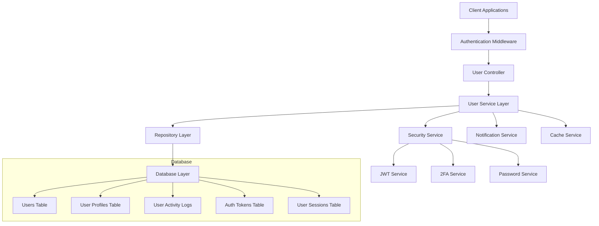

# User System Refactor Design Document

## Overview

This design document outlines the comprehensive refactoring of the user management system for Digi-Pocket. The current system has basic user functionality but lacks modern security features, comprehensive profile management, and administrative capabilities. The refactored system will provide a robust, secure, and scalable user management solution.

## Architecture

### High-Level Architecture



### Service Layer Architecture

The user system will be organized into several specialized services:

1. **UserService**: Core user CRUD operations and business logic
2. **AuthService**: Authentication, authorization, and session management
3. **ProfileService**: User profile and preference management
4. **SecurityService**: Security features like 2FA, password policies
5. **ActivityService**: User activity tracking and audit logging
6. **AdminService**: Administrative user management functions

## Components and Interfaces

### Database Schema Design

#### Enhanced Users Table
```typescript
export const users = pgTable("users", {
  id: uuid("id").defaultRandom().primaryKey(),
  username: varchar("username", { length: 50 }).notNull().unique(),
  email: varchar("email", { length: 100 }).notNull().unique(),
  passwordHash: varchar("password_hash", { length: 200 }).notNull(),
  role: roleEnum("role").notNull().default("customer"),
  status: statusEnum("status").notNull().default("active"),
  
  // Profile fields
  firstName: varchar("first_name", { length: 50 }),
  lastName: varchar("last_name", { length: 50 }),
  displayName: varchar("display_name", { length: 100 }),
  phoneNumber: varchar("phone_number", { length: 20 }),
  dateOfBirth: date("date_of_birth"),
  gender: genderEnum("gender"),
  avatarUrl: text("avatar_url"),
  bio: text("bio"),
  
  // Verification status
  isEmailVerified: boolean("is_email_verified").notNull().default(false),
  isPhoneVerified: boolean("is_phone_verified").notNull().default(false),
  
  // Security and tracking
  lastLoginAt: timestamp("last_login_at", { withTimezone: true }),
  failedLoginAttempts: integer("failed_login_attempts").default(0),
  lockedUntil: timestamp("locked_until", { withTimezone: true }),
  twoFactorEnabled: boolean("two_factor_enabled").default(false),
  twoFactorSecret: varchar("two_factor_secret", { length: 32 }),
  
  // Preferences and metadata
  preferences: jsonb("preferences").default({}),
  metadata: jsonb("metadata").default({}),
  
  createdAt: timestamp("created_at", { withTimezone: true }).defaultNow(),
  updatedAt: timestamp("updated_at", { withTimezone: true }).defaultNow(),
});
```

#### User Profiles Table
```typescript
export const userProfiles = pgTable("user_profiles", {
  id: uuid("id").defaultRandom().primaryKey(),
  userId: uuid("user_id").notNull().references(() => users.id, { onDelete: "cascade" }).unique(),
  
  // Address information
  address: text("address"),
  city: varchar("city", { length: 100 }),
  state: varchar("state", { length: 100 }),
  country: varchar("country", { length: 100 }),
  postalCode: varchar("postal_code", { length: 20 }),
  
  // Localization
  language: varchar("language", { length: 10 }).default("th"),
  timezone: varchar("timezone", { length: 50 }).default("Asia/Bangkok"),
  
  // Social and interests
  website: text("website"),
  socialLinks: jsonb("social_links").default({}),
  interests: jsonb("interests").default([]),
  
  createdAt: timestamp("created_at", { withTimezone: true }).defaultNow(),
  updatedAt: timestamp("updated_at", { withTimezone: true }).defaultNow(),
});
```

#### Activity Logging Tables
```typescript
export const userActivityLogs = pgTable("user_activity_logs", {
  id: uuid("id").defaultRandom().primaryKey(),
  userId: uuid("user_id").notNull().references(() => users.id, { onDelete: "cascade" }),
  action: varchar("action", { length: 100 }).notNull(),
  details: jsonb("details").default({}),
  ipAddress: varchar("ip_address", { length: 50 }),
  userAgent: text("user_agent"),
  createdAt: timestamp("created_at", { withTimezone: true }).defaultNow(),
});

export const userSessions = pgTable("user_sessions", {
  id: uuid("id").defaultRandom().primaryKey(),
  userId: uuid("user_id").notNull().references(() => users.id, { onDelete: "cascade" }),
  sessionToken: varchar("session_token", { length: 200 }).notNull().unique(),
  deviceInfo: jsonb("device_info").default({}),
  ipAddress: varchar("ip_address", { length: 50 }),
  isActive: boolean("is_active").default(true),
  expiresAt: timestamp("expires_at", { withTimezone: true }).notNull(),
  createdAt: timestamp("created_at", { withTimezone: true }).defaultNow(),
});
```

### Service Interfaces

#### UserService Interface
```typescript
interface IUserService {
  // Basic CRUD
  create(userData: CreateUserRequest): Promise<User>;
  findById(id: string): Promise<User | null>;
  findByEmail(email: string): Promise<User | null>;
  findByUsername(username: string): Promise<User | null>;
  update(id: string, data: UpdateUserRequest): Promise<User>;
  delete(id: string): Promise<void>;
  
  // User management
  list(filters: UserListFilters): Promise<PaginatedUsers>;
  search(query: string): Promise<User[]>;
  updateStatus(id: string, status: UserStatus): Promise<User>;
  updateRole(id: string, role: UserRole): Promise<User>;
}
```

#### AuthService Interface
```typescript
interface IAuthService {
  // Authentication
  login(credentials: LoginCredentials): Promise<AuthResult>;
  logout(sessionToken: string): Promise<void>;
  refreshToken(refreshToken: string): Promise<AuthResult>;
  
  // Registration and verification
  register(userData: RegisterRequest): Promise<User>;
  verifyEmail(token: string): Promise<boolean>;
  resendVerification(email: string): Promise<void>;
  
  // Password management
  changePassword(userId: string, oldPassword: string, newPassword: string): Promise<void>;
  requestPasswordReset(email: string): Promise<void>;
  resetPassword(token: string, newPassword: string): Promise<void>;
  
  // Session management
  validateSession(sessionToken: string): Promise<User | null>;
  invalidateAllSessions(userId: string): Promise<void>;
}
```

#### SecurityService Interface
```typescript
interface ISecurityService {
  // Two-factor authentication
  enableTwoFactor(userId: string): Promise<{ secret: string; qrCode: string }>;
  verifyTwoFactor(userId: string, token: string): Promise<boolean>;
  disableTwoFactor(userId: string, password: string): Promise<void>;
  generateBackupCodes(userId: string): Promise<string[]>;
  
  // Security monitoring
  logActivity(userId: string, action: string, details: any, request: Request): Promise<void>;
  checkSuspiciousActivity(userId: string): Promise<SecurityAlert[]>;
  lockAccount(userId: string, reason: string): Promise<void>;
  unlockAccount(userId: string): Promise<void>;
}
```

## Data Models

### Core Types
```typescript
// User types
export type UserRole = 'admin' | 'customer' | 'agent' | 'support';
export type UserStatus = 'active' | 'suspended' | 'banned' | 'pending' | 'inactive';
export type Gender = 'male' | 'female' | 'other' | 'prefer_not_to_say';

// Request/Response types
export interface CreateUserRequest {
  username: string;
  email: string;
  password: string;
  firstName?: string;
  lastName?: string;
  role?: UserRole;
}

export interface UpdateUserRequest {
  firstName?: string;
  lastName?: string;
  displayName?: string;
  phoneNumber?: string;
  dateOfBirth?: string;
  gender?: Gender;
  bio?: string;
  preferences?: Record<string, any>;
}

export interface LoginCredentials {
  identifier: string; // email or username
  password: string;
  twoFactorToken?: string;
  rememberMe?: boolean;
}

export interface AuthResult {
  user: User;
  accessToken: string;
  refreshToken: string;
  expiresIn: number;
}

// Filter and pagination types
export interface UserListFilters {
  role?: UserRole;
  status?: UserStatus;
  search?: string;
  page?: number;
  limit?: number;
  sortBy?: string;
  sortOrder?: 'asc' | 'desc';
}

export interface PaginatedUsers {
  users: User[];
  total: number;
  page: number;
  limit: number;
  totalPages: number;
}
```

### Validation Schemas
```typescript
// Zod schemas for validation
export const createUserSchema = z.object({
  username: z.string().min(3).max(50).regex(/^[a-zA-Z0-9_]+$/),
  email: z.string().email(),
  password: z.string().min(8).regex(/^(?=.*[a-z])(?=.*[A-Z])(?=.*\d)(?=.*[@$!%*?&])[A-Za-z\d@$!%*?&]/),
  firstName: z.string().min(1).max(50).optional(),
  lastName: z.string().min(1).max(50).optional(),
  role: z.enum(['admin', 'customer', 'agent', 'support']).optional(),
});

export const updateUserSchema = z.object({
  firstName: z.string().min(1).max(50).optional(),
  lastName: z.string().min(1).max(50).optional(),
  displayName: z.string().min(1).max(100).optional(),
  phoneNumber: z.string().regex(/^\+?[1-9]\d{1,14}$/).optional(),
  dateOfBirth: z.string().regex(/^\d{4}-\d{2}-\d{2}$/).optional(),
  gender: z.enum(['male', 'female', 'other', 'prefer_not_to_say']).optional(),
  bio: z.string().max(500).optional(),
});
```

## Error Handling

### Custom Error Classes
```typescript
export class UserError extends Error {
  constructor(message: string, public code: string, public statusCode: number = 400) {
    super(message);
    this.name = 'UserError';
  }
}

export class AuthenticationError extends UserError {
  constructor(message: string = 'Authentication failed') {
    super(message, 'AUTH_FAILED', 401);
    this.name = 'AuthenticationError';
  }
}

export class AuthorizationError extends UserError {
  constructor(message: string = 'Access denied') {
    super(message, 'ACCESS_DENIED', 403);
    this.name = 'AuthorizationError';
  }
}

export class ValidationError extends UserError {
  constructor(message: string, public field?: string) {
    super(message, 'VALIDATION_ERROR', 400);
    this.name = 'ValidationError';
  }
}
```

### Error Handling Strategy
1. **Input Validation**: Use Zod schemas to validate all inputs
2. **Database Errors**: Catch and transform database constraint violations
3. **Authentication Errors**: Provide clear but secure error messages
4. **Rate Limiting**: Implement rate limiting for sensitive operations
5. **Logging**: Log all errors with appropriate detail levels

## Testing Strategy

### Unit Testing
- **Service Layer**: Test all business logic with mocked dependencies
- **Repository Layer**: Test database operations with test database
- **Validation**: Test all Zod schemas with valid and invalid inputs
- **Security Functions**: Test password hashing, JWT generation, 2FA

### Integration Testing
- **API Endpoints**: Test complete request/response cycles
- **Authentication Flow**: Test login, registration, password reset flows
- **Database Transactions**: Test complex multi-table operations
- **External Services**: Test email sending, file uploads

### Security Testing
- **Authentication**: Test various attack scenarios
- **Authorization**: Test role-based access control
- **Input Validation**: Test SQL injection, XSS prevention
- **Rate Limiting**: Test brute force protection

### Performance Testing
- **Database Queries**: Test query performance with large datasets
- **Caching**: Test cache hit rates and invalidation
- **Concurrent Users**: Test system under load
- **Memory Usage**: Monitor for memory leaks

## Security Considerations

### Password Security
- Use bcrypt with minimum 12 rounds for password hashing
- Implement password strength requirements
- Store password reset tokens with short expiration
- Invalidate all sessions on password change

### Session Management
- Use secure, httpOnly cookies for session tokens
- Implement session timeout and renewal
- Track active sessions per user
- Provide session management UI for users

### Two-Factor Authentication
- Support TOTP (Time-based One-Time Password)
- Generate secure backup codes
- Require password confirmation to disable 2FA
- Log all 2FA events

### API Security
- Implement rate limiting on all endpoints
- Use CORS properly for web clients
- Validate all inputs server-side
- Log security events for monitoring

### Data Protection
- Encrypt sensitive data at rest
- Use HTTPS for all communications
- Implement proper data retention policies
- Provide data export/deletion for GDPR compliance